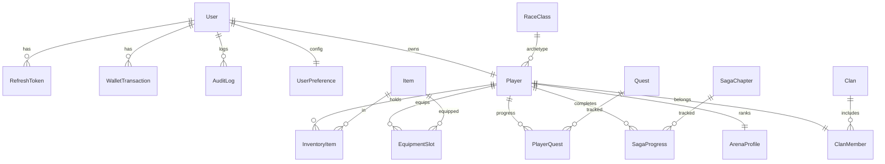

# Chrono Saiya RPG (RPG de navegador inspirado em anime)

Projeto completo (frontend + backend) para um RPG web com progressão, arenas, sagas originais e painel estilo anime. Todo o conteúdo é **original** e não usa nomes ou assets protegidos.

## Stack
- **Frontend:** React + Vite + TypeScript
- **Backend:** Node.js (Express) + TypeScript
- **Banco:** MySQL (compatível com XAMPP)
- **ORM:** Prisma
- **Auth:** JWT + Refresh Token
- **Upload:** Storage local (com opção S3 compatível)
- **Tempo real:** Socket.IO (chat e notificações)
- **Cache:** Redis opcional (não usado no starter para manter o compose simples; as rotas já estão prontas para cache futuro).

## UI/UX
- Layout com **3 colunas** pós-login: perfil + mundo (esquerda), atividades + rankings (centro), menu vertical (direita).
- Busca global com lupa.
- Tema escuro com contraste forte e responsivo.
- Paleta original: `nebula` + `glow`.
- Descrição detalhada do layout: `docs/layout.md`.

## Decisões técnicas
- **Combate:** auto-battle (mais adequado a jogo de navegador assíncrono). Fórmula de dano combina ataque/defesa/agilidade, chance crítica e variação pequena.
- **Segurança:** bcrypt (12 rounds), rate limit, validação com Zod, logs de auditoria, CORS configurado.
- **LEGACY_MD5:** modo opcional que aceita MD5 apenas para usuários marcados como legado. Em login válido, rehash automático para bcrypt e desativa `legacyMd5`.

## Estrutura de pastas
```
backend/
  prisma/
  src/
frontend/
  src/
```

### Rotas principais (REST)
- **Auth:** `/auth/register`, `/auth/login`, `/auth/refresh`, `/auth/logout`, `/auth/forgot`, `/auth/reset`
- **Player:** `/player/me`, `/player/create`, `/player/stats`, `/player/equip`
- **Quests:** `/quests`, `/quests/claim`
- **Arena:** `/arena/attack`, `/arena/rank`
- **Treino:** `/training/start`, `/training/status`, `/training/cancel`
- **Sagas:** `/sagas`, `/sagas/start`
- **Torneio:** `/tournament`, `/tournament/join`
- **Eventos/Desafios:** `/events/season`, `/events/challenges`
- **Recompensa diária:** `/rewards/daily`, `/rewards/daily/claim`
- **Shop:** `/shop/items`, `/shop/buy`
- **Inventário:** `/inventory`, `/inventory/craft`
- **Preferências:** `/settings/preferences`, `/settings/2fa/enable`, `/settings/2fa/disable`
- **Clan:** `/clan/create`, `/clan/invite`
- **Admin:** `/admin/users`, `/admin/users/:id/ban`, `/admin/logs`

## Banco de dados
### Diagrama lógico (simplificado)


## Combate (auto-battle)
Fórmula base (server-side):
- **Ataque:** `strength * 1.4 + agility * 0.6`
- **Defesa:** `defense * 1.2 + agility * 0.4`
- **Dano bruto:** `max(5, ataque - defesa * 0.7)`
- **Crítico:** `critChance + speed * 0.002`
- **Variação:** `0.9 ~ 1.1`

Resultados são registrados em `BattleLog` com resumo do combate.

### Seeds
- Raças/classes originais (Aurion, Nyxari, Terrakai).
- Itens básicos.
- Quests de exemplo.
- 3 capítulos de saga.

## Configuração
1) Copie `.env.example` em `backend/.env` e ajuste.
2) Suba serviços:
```
docker compose up --build
```
3) Rode migrações e seeds:
```
cd backend
npm install
npm run prisma:migrate
npm run prisma:seed
```

## Segurança (resumo)
- **bcrypt** com 12+ salt rounds.
- **LEGACY_MD5** opcional com migração automática.
- **Rate limit** por IP.
- **CORS** configurado.
- **Logs de auditoria** para login, transações, PvP e admin.
- **CSRF**: não aplicado no starter pois o auth usa Bearer Token; se usar cookies, habilitar proteção.
- **Detecção de fraude**: hook básico no PvP para flag de padrões suspeitos.
- **2FA (TOTP)**: stub de habilitação no backend, pronto para integração com biblioteca TOTP.

## Scripts úteis
- Backend: `npm run dev` / `npm run test`
- Frontend: `npm run dev`

## Observações
- Conteúdo do universo (raças, classes, sagas) é 100% original.
- Assets são placeholders estilizados por CSS.
- Redis pode ser plugado no futuro para cache de rankings.
